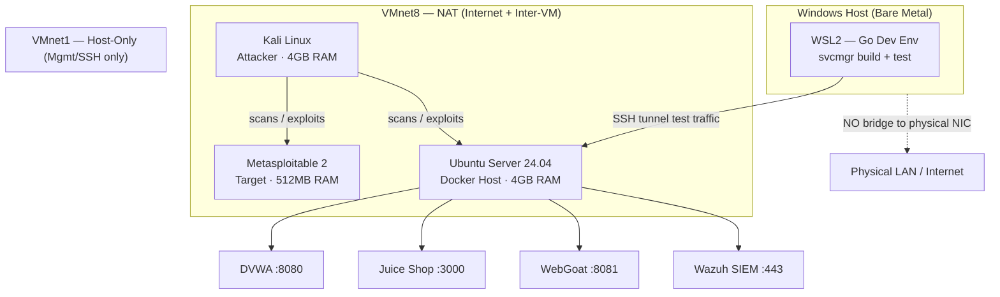

# 🛡️ Stellar Range — Cyber Lab + svcmgr Dev Sandbox

> Dual-track build log: an isolated VMware cyber range for offensive/defensive security training, paired with native development of **svcmgr** (Stellar Service Manager) — a Go/Cobra CLI for encrypted server management, SSH tunneling, and structured logging.

**Go 1.22** &nbsp;·&nbsp; **Status:** Active Development &nbsp;·&nbsp; **Platform:** VMware + WSL2 &nbsp;·&nbsp; **License:** MIT

## 📡 Overview

| | |
|---|---|
| **Operator Track** | Build and operate an isolated cybersecurity home lab — offensive (Kali), vulnerable targets (Metasploitable, DVWA, Juice Shop, WebGoat), and SOC monitoring (Wazuh) |
| **Developer Track** | Build `svcmgr`, a Go/Cobra CLI for secure server management — AES-256 encrypted local config (`~/.config/svcmgr/`), SSH tunneling, structured JSON logging |
| **Why combined** | The lab VMs double as safe, isolated SSH targets for testing svcmgr's tunneling features without touching production infrastructure |

## 🗺️ Network Topology



**Isolation guarantee:** no VM adapter is ever set to *Bridged*. All lab traffic stays inside VMware's virtual NAT/Host-only switches — it never reaches the home/employer physical network.

## 💻 Resource Allocation

| Component | RAM | Disk | Network | Status |
|---|---|---|---|---|
| Kali Linux | 4 GB | 25 GB | NAT (VMnet8) | ✅ Active |
| Ubuntu Server (Docker host) | 4 GB | 20 GB | NAT + Host-only | ⬜ Planned |
| Metasploitable 2 | 0.5 GB | 3 GB | NAT (VMnet8) | ⬜ Planned |
| WSL2 (Go dev env) | dynamic | ~5 GB | Windows host | ⬜ Planned |
| ~~pfSense~~ | ~~1 GB~~ | ~~8 GB~~ | — | ⏸ Deferred (Phase 2) |
| ~~Windows Server DC~~ | ~~4 GB~~ | ~~30 GB~~ | — | ⏸ Deferred (Phase 2) |
| ~~Windows 10 Client~~ | ~~4 GB~~ | ~~40 GB~~ | — | ⏸ Deferred (Phase 2) |

*Host baseline assumed: 16 GB RAM / 189 GB free storage — update with your actual `msinfo32` numbers.*

## 🎯 Mission

**Operator Track**
- [ ] Network fundamentals (IP/ports/protocols)
- [ ] SSH key-based auth + tunneling
- [ ] First Nmap scan, Kali → Metasploitable
- [ ] DVWA / Juice Shop walkthroughs
- [ ] Wazuh SIEM live, alerting on Kali scans

**Developer Track**
- [ ] Go fundamentals (structs, interfaces, error handling)
- [ ] Cobra CLI structure (commands, flags, subcommands)
- [ ] Read svcmgr source top-down
- [ ] First contribution (flag, log field, or test)
- [ ] svcmgr SSH tunnel verified against isolated lab VM

## ✅ Milestone Log

| Date | Phase | Milestone | Notes |
|---|---|---|---|
| | Setup | Kali Linux imported | |
| | Setup | VMware NAT + Host-only configured | Replaces pfSense for now |
| | Setup | WSL2 + Go toolchain installed | |
| | Lab | Ubuntu Docker host deployed | |
| | Lab | DVWA / Juice Shop / WebGoat running | |
| | Dev | svcmgr builds cleanly (`go build ./...`) | |
| | Dev | First SSH tunnel test (WSL2 → lab VM) | |
| | Phase 2 | pfSense reintroduced (RAM permitting) | |
| | Phase 2 | Windows AD lab (DC + client) online | |

## 📁 Repository Structure

```
svcmgr/
├── cmd/                # Cobra command definitions
├── internal/
│   ├── config/          # AES-256 config storage logic
│   ├── ssh/              # Tunneling implementation
│   └── logging/        # Structured JSON logger
├── docs/
│   └── lab-notes/      # Cyber lab build logs, this README
├── go.mod
├── go.sum
└── README.md
```

## 🧰 Tech Stack

| Layer | Tools |
|---|---|
| Hypervisor | VMware Workstation |
| Offense | Kali Linux |
| Targets | Metasploitable 2, DVWA, OWASP Juice Shop, WebGoat |
| SOC | Wazuh SIEM |
| Dev environment | WSL2 (Ubuntu), Go, VS Code (Remote-WSL) |
| CLI framework | Cobra |
| Security | AES-256 (config-at-rest), SSH (transport) |

## 🚀 Getting Started

```bash
# Clone
git clone https://github.com/<your-username>/svcmgr.git
cd svcmgr

# Build (inside WSL2)
go build ./...

# Run tests
go test ./...
```

## 🔒 Isolation & Safety Notes

- All lab VM adapters use **NAT (VMnet8)** or **Host-only (VMnet1)** — never Bridged.
- svcmgr's SSH tunneling is tested exclusively against the isolated Ubuntu lab VM, not external hosts.
- Encryption keys for `~/.config/svcmgr/` are never committed to this repo.

## 📄 License

MIT — see `LICENSE`.
